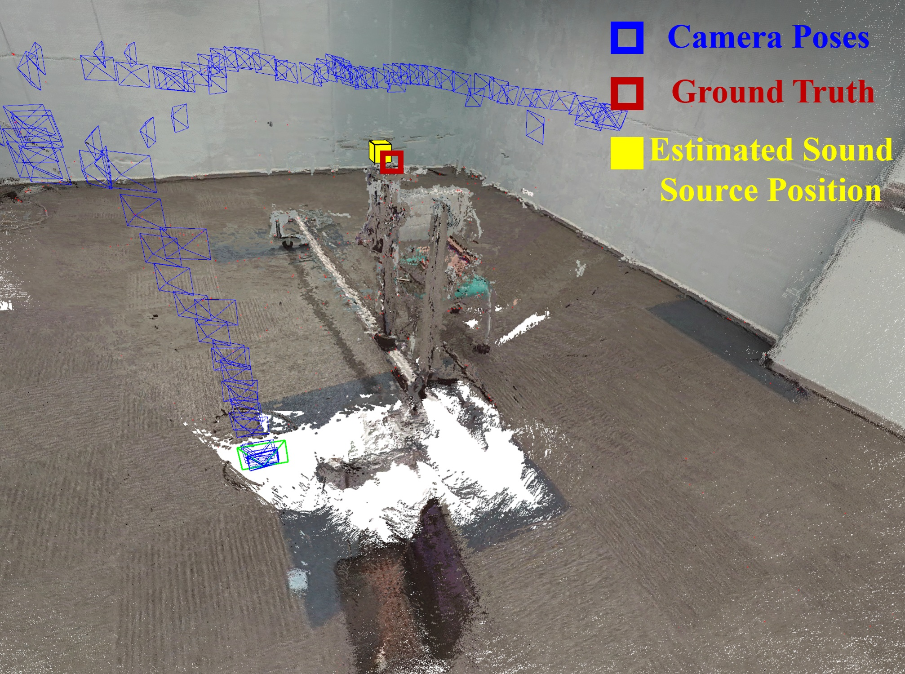
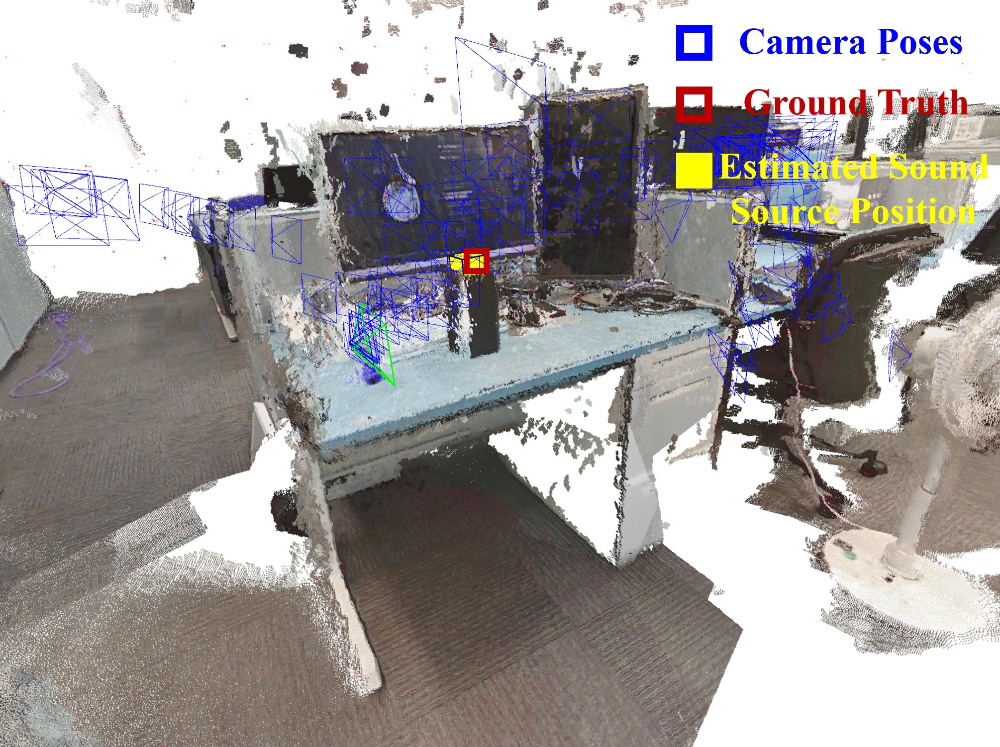

# 3D-SoundSourceMapping
Accurately localizing sound sources and mapping them into the environment is crucial for human–robot interaction and augmented reality. Existing methods typically assume that other sensors, such as cameras or LiDAR, have been spatially calibrated with the microphone array, allowing their measured poses (i.e., orientation and translation) to be converted into the microphone array poses. However, estimating the relative pose between sensors is a complex task. In this work, we propose a 3D sound source mapping method using an acoustic camera with unknown relative poses between the camera and the microphone array.

    
    

# Prerequisites
We have tested the library in **Ubuntu 18.04**, but it should be easy to compile in other platforms. A powerful computer will ensure more stable and accurate results.

## C++11 or C++0x Compiler
We use the new thread and chrono functionalities of C++11.

## Pangolin
We use [Pangolin](https://github.com/stevenlovegrove/Pangolin) for visualization and user interface. Dowload and install instructions can be found at: https://github.com/stevenlovegrove/Pangolin.

## OpenCV
We use [OpenCV](http://opencv.org) to manipulate images and features. Dowload and install instructions can be found at: http://opencv.org. **Tested with OpenCV 3.2**.

## Eigen3
Required by g2o (see below). Download and install instructions can be found at: http://eigen.tuxfamily.org. **Required at least 3.1.0**.

## DBoW2 and g2o (Included in Thirdparty folder)
We use modified versions of the [DBoW2](https://github.com/dorian3d/DBoW2) library to perform place recognition and [g2o](https://github.com/RainerKuemmerle/g2o) library to perform non-linear optimizations. Both modified libraries (which are BSD) are included in the *Thirdparty* folder.

## ROS
We provide examples to process the input of RGB-D camera using [ROS](ros.org). Building these examples is optional. In case you want to use ROS, a version Melodic or newer is needed.

# Building 3DSSM library and examples

The code will be released upon acceptance of the paper.
