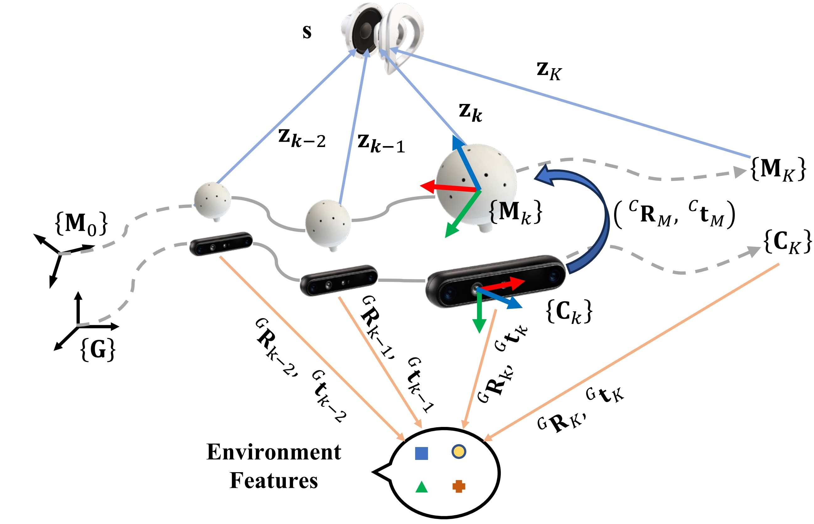
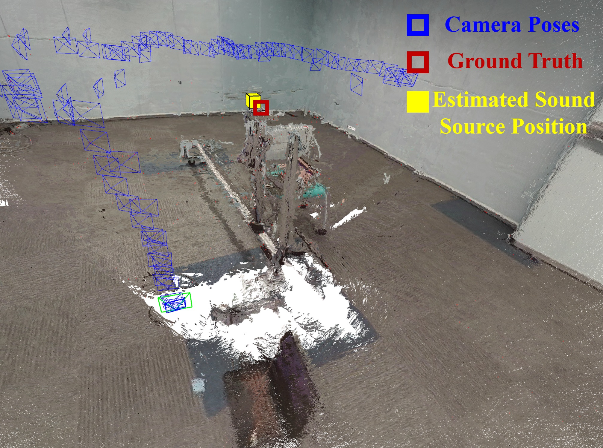
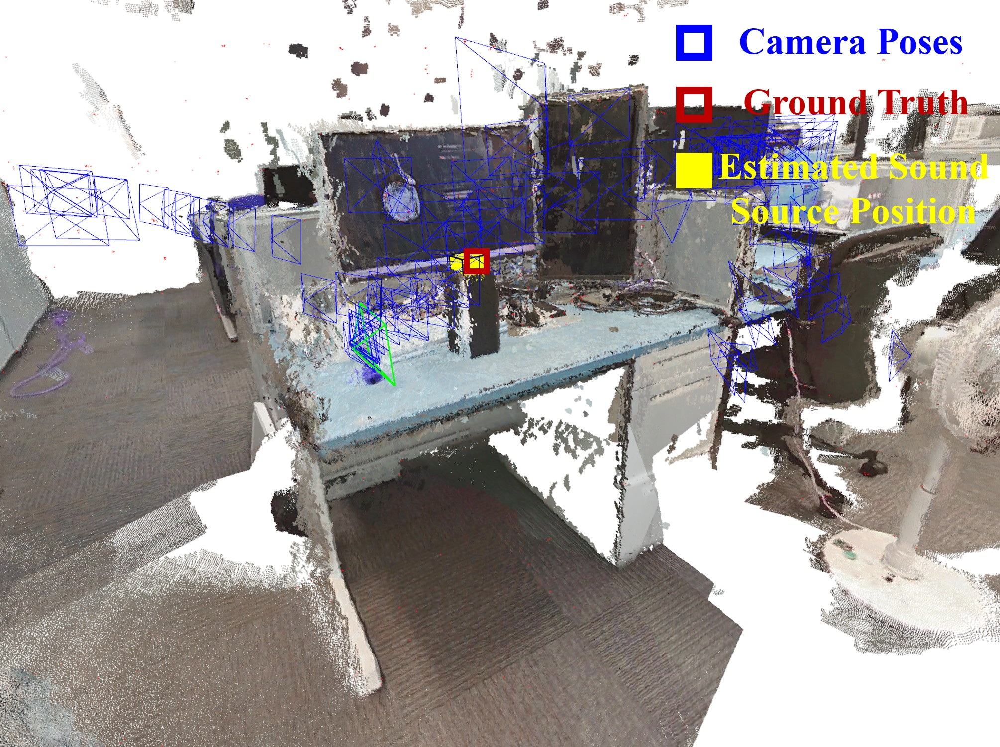

# 3D-Sound Source Mapping
Accurately localizing sound sources and mapping them into the environment is crucial for human–robot interaction and augmented reality. Existing methods typically assume that other sensors, such as cameras or LiDAR, have been spatially calibrated with the microphone array, allowing their measured poses (i.e., orientation and translation) to be converted into the microphone array poses. However, estimating the relative pose between sensors is a complex task. In this work, we propose a 3D sound source mapping method using an acoustic camera with unknown relative poses between the camera and the microphone array.

<div align="center">
    
    
    
</div>

<a href="https://www.youtube.com/embed/KpNJJtaMPqY" target="_blank"></a>

# Prerequisites
We have tested the library in **Ubuntu 18.04 (ROS1)**, but it should be easy to compile in other platforms. A powerful computer will ensure more stable and accurate results.

## Pangolin
We use [Pangolin](https://github.com/stevenlovegrove/Pangolin) for visualization and user interface. Dowload and install instructions can be found at: https://github.com/stevenlovegrove/Pangolin.

## OpenCV
We use [OpenCV](http://opencv.org) to manipulate images and features. Dowload and install instructions can be found at: http://opencv.org. **Tested with OpenCV 3.2**.

## Eigen3
Required by g2o (see below). Download and install instructions can be found at: http://eigen.tuxfamily.org. **Required at least 3.1.0**.

## DBoW2 and g2o (Included in Thirdparty folder)
We use modified versions of the [DBoW2](https://github.com/dorian3d/DBoW2) library to perform place recognition and [g2o](https://github.com/RainerKuemmerle/g2o) library to perform non-linear optimizations. Both modified libraries (which are BSD) are included in the *Thirdparty* folder.

## ROS
We provide examples to process the input of RGB-D camera using [ROS](ros.org).

# Building 3DSSM library and examples

```bash
./build.sh
# and
./build_ros.sh
```

# How to run the Demo

## 1. Start ROS

Open a terminal:

```bash
roscore
```

## 2. Run the ORB-SLAM2 ROS Package
```bash
rosrun ORB_SLAM2 RGBD Vocabulary/ORBvoc.txt Examples/RGB-D/orbbec335l.yaml
```

## 3. Run SSM
```bash
rosrun ORB_SLAM2 SSM.py
```

## 4. Play [ROSBAG](https://pan.baidu.com/s/1SHPVt14nPlxGMr72WF4YGw?pwd=ahqg)
```bash
rosbag play DESK_SOUND_SOURCE.bag /camera/color/image_raw:=/camera/rgb/image_raw /camera/depth/image_raw:=/camera/depth_registered/image_raw
```
## License
The source code and dataset are released under [GPLv3](http://www.gnu.org/licenses/) license.

## Citation
Please cite the paper if you feel helpful for your research.

```bibtex
@INPROCEEDINGS{26SSM,
  author={Wang, Jiang and Shi, Runwu and Li, Jiahui and Kong, He and Nakadai, Kazuhiro},
  booktitle={ICASSP 2026 - 2026 IEEE International Conference on Acoustics, Speech and Signal Processing (ICASSP)}, 
  title={Manifold-Optimization-Based 3D Sound Source Mapping with Unknown Camera-Microphone Array Relative Pose}, 
  year={2026},
  pages={21026-21030},
  keywords={Location awareness;Mobile communication;Protocols;HTTP;Indoor environment;Machine learning;Boosting;Deep learning;Reinforcement learning;Learning systems;Sound source mapping;acoustic camera;optimization},
  doi={10.1109/ICASSP55912.2026.11462576}}
}
```
